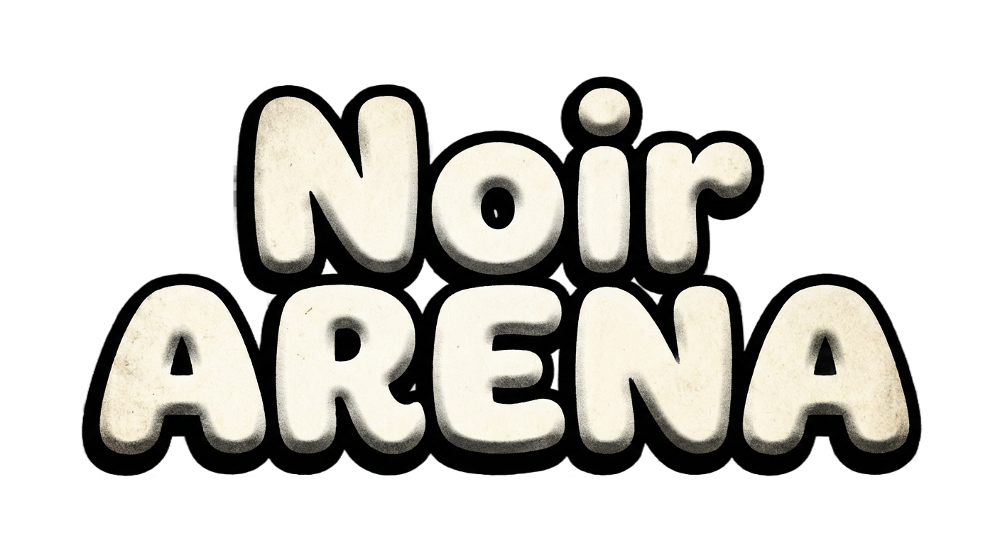

# 🎮 Noir Arena

<p align="center">
  
</p>

**Noir Arena**, Brotato tarzı bir hayatta kalma/arena oyunudur. Godot 4.5 ile geliştirilmiştir.

[](https://github.com/mrnasil/cardboardwar/actions/workflows/build-ios.yml)
[](https://github.com/mrnasil/cardboardwar/actions/workflows/build-macos.yml)

## 🎯 Oyun Özellikleri

- **Wave-based Survival**: Giderek zorlaşan düşman dalgalarına karşı hayatta kalın
- **Çeşitli Karakterler**: 6 benzersiz oynanabilir karakter (Well Rounded, Brawler, Bunny, Cardboard, Crazy, Knight)
- **Silah Çeşitliliği**: Punch, Knife, Pistol ve daha fazlası
- **Düşman Türleri**: Chaser, Charger, Wanderer, Shooter, Splitter
- **Noir Tema**: Siyah-beyaz film noir estetiği

## 🚀 Kurulum

### Gereksinimler

- [Godot Engine 4.5.1](https://godotengine.org/download)

### Projeyi Çalıştırma

1. Bu repoyu klonlayın:
   ```bash
   git clone https://github.com/mrnasil/cardboardwar.git
   ```
2. Godot 4.5.1 ile `project.godot` dosyasını açın
3. F5 ile oyunu başlatın

## 📱 Platformlar

| Platform | Durum                            |
| -------- | -------------------------------- |
| Windows  | ✅ Destekleniyor                 |
| macOS    | ✅ Destekleniyor                 |
| Android  | ✅ Destekleniyor                 |
| iOS      | 🔄 Unsigned IPA (GitHub Actions) |
| Web      | 🔜 Planlanıyor                   |

## 🏗️ Proje Yapısı

```
├── assets/           # Görsel ve ses dosyaları
│   ├── font/         # Font dosyaları (Nunito)
│   └── sprites/      # Oyun görselleri
├── autoloads/        # Singleton scriptler
├── docs/             # Oyun dokümantasyonu
├── resources/        # Godot kaynakları (.tres)
├── scenes/           # Oyun sahneleri (.tscn)
│   ├── arena/        # Ana oyun alanı
│   ├── ui/           # Kullanıcı arayüzü
│   ├── unit/         # Oyuncu ve düşman birimleri
│   └── weapons/      # Silah sistemleri
└── localization/     # Çoklu dil desteği (TR, EN)
```

## 🎨 Karakter ve Silah Sistemi

Detaylı dokümantasyon için [docs/README.md](docs/README.md) dosyasına bakın.

## 🤝 Katkıda Bulunma

1. Bu repoyu fork edin
2. Feature branch oluşturun (`git checkout -b feature/AmazingFeature`)
3. Değişikliklerinizi commit edin (`git commit -m 'Add some AmazingFeature'`)
4. Branch'inizi push edin (`git push origin feature/AmazingFeature`)
5. Pull Request açın

## 📄 Lisans

Bu proje özel bir projedir. Tüm hakları saklıdır.

## 🙏 Teşekkürler

- [Godot Engine](https://godotengine.org/) - Açık kaynak oyun motoru
- [Nunito Font](https://fonts.google.com/specimen/Nunito) - Google Fonts

---

<p align="center">
  Made with ❤️ by Clicker Games
</p>
